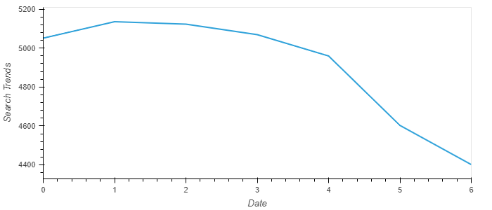
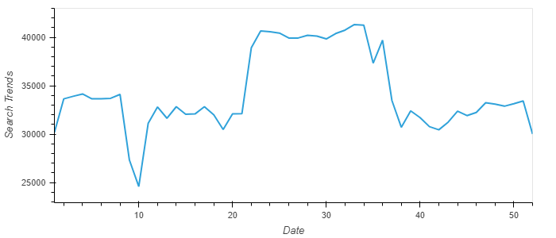
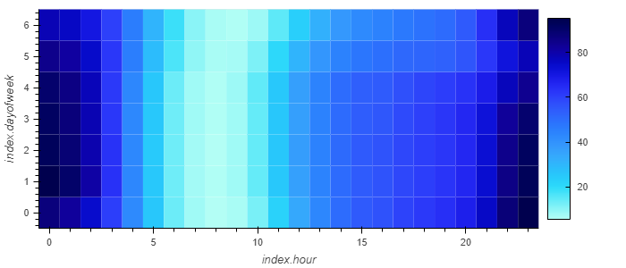
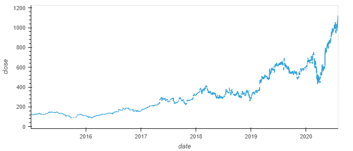
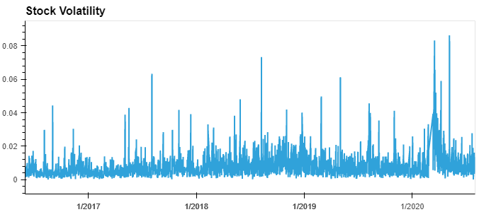
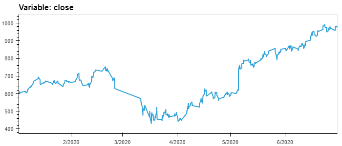
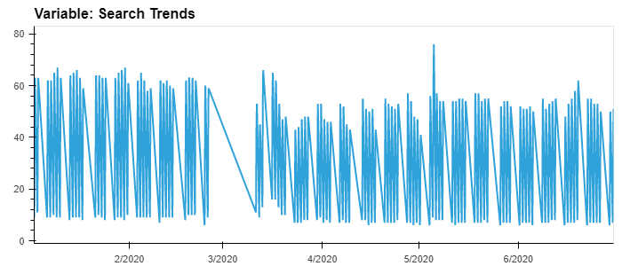
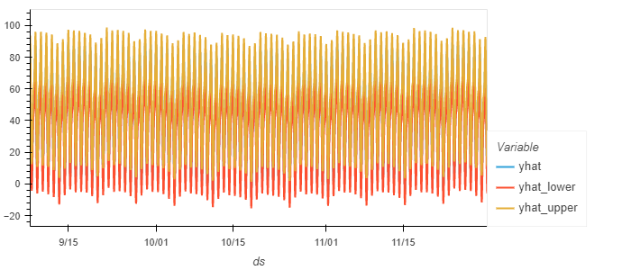

# Forecasting_Net_Prophet

This application utilizes web traffic data from e-commerce site, MercadoLibre, to explore time series trends in the company's sales and stock price. Additionaly, Prophet is used to create time series forecast models.

---

## Technologies

This project leverages python 3.7 and created with Google Colab. It utilizes the following packages:

**[Pandas Library Python](https://pandas.pydata.org/)** - a fast, powerful, flexible and easy to use open source data analysis and manipulation tool.<br>

**[HoloViews Library Python](https://holoviews.org/)** - an open-source Python library designed to make data analysis and visualization seamless and simple. <br>

**[Prophet](https://facebook.github.io/prophet/)** - is open source software released by Facebook’s Core Data Science team. Prophet is a procedure for forecasting time series data based on an additive model where non-linear trends are fit with yearly, weekly, and daily seasonality, plus holiday effects.<br>

**[datetime Module](https://docs.python.org/3/library/datetime.html)** - supplies classes for manipulating dates and times.<br>

**[Numpy Library Python](https://numpy.org/)** -  comprehensive mathematical functions.<br>

**[Matplotlib Python](https://matplotlib.org/)** - comprehensive library for creating static, animated, and interactive visualizations in Python.<br>

---

## Installation Guide

Before running the application first install the following dependencies:

1) Pandas Library is included with Anaconda so no need to install.<br>

2) In order to use the HoloViews library, you must install it by writing this command in your terminal:

```python
pip install holoviews
```

3) In order to use Prophet, you must install it by writing this command in your Google Colab terminal:

```python
pip install fbprophet
```

4) datetime is included with Anaconda so no need to install.<br>

5) Numpy Library is included with Anaconda so no need to install.<br>

6) Matplotlib is included with Anaconda so no need to install.<br>


The installation of libraries and dependencies is now complete.

---

## Usage

To use the application simply clone the repository and run the **forecasting_net_prophet.ipynb** file in Google Colab.

Completed analysis will produce the below visualizations:

Seasonality plots:






Stock Price History and Stock Volatility plots:




Stock Price/Volatility vs Search Traffic plots:




Prophet plots:



---

## Contributors

**Contributor:** Lindsey Hardouin<br>
**Email Address:** lindseyhardouin@gmail.com<br>
